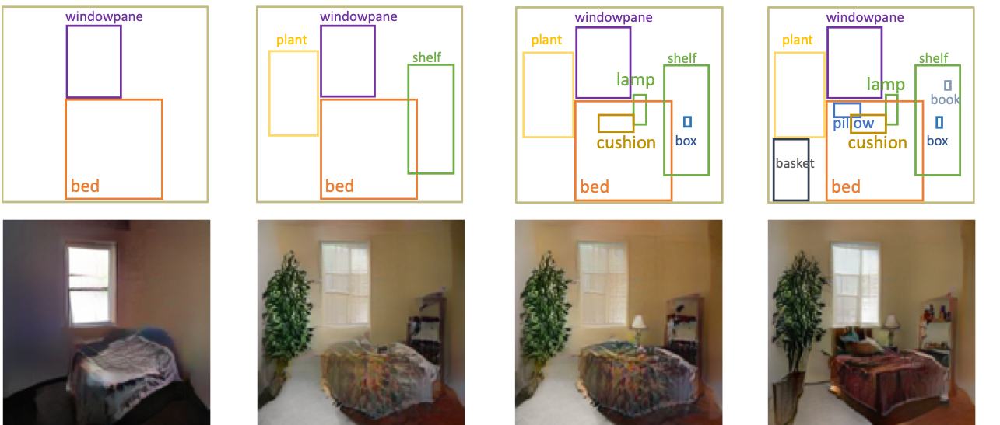

# BachGAN: High-Resolution Image Synthesis from Salient Object Layout

### Qualitive Results
#### Examples of image synthesis results from different models on the Cityscapes dataset

#### Examples of image synthesis results from different models on the ADE20K dataset

#### Examples of generated images by adding bounding boxes sequentially according to previous layout on Cityscapes.

#### Examples of generated images by adding bounding boxes sequentially according to previous layout on ADE20K.


BachGAN: High-Resolution Image Synthesis from Salient Object Layout.<br>
[Yandong Li](https://cold-winter.github.io/),  [Yu Cheng](https://sites.google.com/site/chengyu05/home),  [Zhe Gan](http://zhegan27.github.io/),  [Licheng Yu](https://www.cs.unc.edu/~licheng/),  [Liqiang Wang](http://www.cs.ucf.edu/~lwang/), and [Jingjing Liu](http://people.csail.mit.edu/jingl/)<br>
In CVPR 2020.
<!--
### [Project page](https://nvlabs.github.io/SPADE/) |   [Paper](https://arxiv.org/abs/1903.07291) | [GTC 2019 demo](https://youtu.be/p5U4NgVGAwg) | [Youtube Demo of GauGAN](https://youtu.be/MXWm6w4E5q0)

Semantic Image Synthesis with Spatially-Adaptive Normalization.<br>
[Taesung Park](http://taesung.me/),  [Ming-Yu Liu](http://mingyuliu.net/), [Ting-Chun Wang](https://tcwang0509.github.io/),  and [Jun-Yan Zhu](http://people.csail.mit.edu/junyanz/).<br>
In CVPR 2019 (Oral).

### [License](https://raw.githubusercontent.com/nvlabs/SPADE/master/LICENSE.md)

Copyright (C) 2019 NVIDIA Corporation.

All rights reserved.
Licensed under the [CC BY-NC-SA 4.0](https://creativecommons.org/licenses/by-nc-sa/4.0/legalcode) (**Attribution-NonCommercial-ShareAlike 4.0 International**)

The code is released for academic research use only. For commercial use, please contact [researchinquiries@nvidia.com](researchinquiries@nvidia.com).

## Installation

Clone this repo.
```bash
git clone https://github.com/NVlabs/SPADE.git
cd SPADE/
```

This code requires PyTorch 1.0 and python 3+. Please install dependencies by
```bash
pip install -r requirements.txt
```

This code also requires the Synchronized-BatchNorm-PyTorch rep.
```
cd models/networks/
git clone https://github.com/vacancy/Synchronized-BatchNorm-PyTorch
cp -rf Synchronized-BatchNorm-PyTorch/sync_batchnorm .
cd ../../
```

To reproduce the results reported in the paper, you would need an NVIDIA DGX1 machine with 8 V100 GPUs.

## Dataset Preparation

For Cityscapes or ADE20K, the datasets must be downloaded beforehand. Please download them on the respective webpages. 


**Preparing ADE20K Dataset**. The dataset can be downloaded [here](http://data.csail.mit.edu/places/ADEchallenge/ADEChallengeData2016.zip), which is from [MIT Scene Parsing BenchMark](http://sceneparsing.csail.mit.edu/). After unzipping the datgaset, put the jpg image files `ADEChallengeData2016/images/` and png label files `ADEChallengeData2016/annotatoins/` in the same directory. 

There are different modes to load images by specifying `--preprocess_mode` along with `--load_size`. `--crop_size`. There are options such as `resize_and_crop`, which resizes the images into square images of side length `load_size` and randomly crops to `crop_size`. `scale_shortside_and_crop` scales the image to have a short side of length `load_size` and crops to `crop_size` x `crop_size` square. To see all modes, please use `python train.py --help` and take a look at `data/base_dataset.py`. By default at the training phase, the images are randomly flipped horizontally. To prevent this use `--no_flip`.


-->

### Citation
If you use this code for your research, please cite our papers.
```
@inproceedings{li2020BachGAN,
  title={BachGAN: High-Resolution Image Synthesis from Salient Object Layout},
  author={Li, Yandong and Cheng, Yu and Gan, Zhe and Yu, Licheng and Wang, Liqiangand Liu, Jingjing},
  booktitle={Proceedings of the IEEE Conference on Computer Vision and Pattern Recognition},
  year={2020}
}
```

## Acknowledgments
Pytorh-fid is from @[mseitzer's implementation](https://github.com/mseitzer/pytorch-fid).<br>
This code borrows heavily from pix2pixHD and [SPADE](https://github.com/nvlabs/spade/). We thank Jiayuan Mao for his Synchronized Batch Normalization code.
